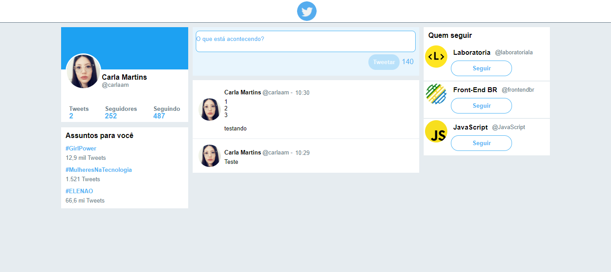

# Twitter

Reprodução do Twitter que permite a inserção de mensagens de texto.

## Captura da Tela ##

#Features:

- Permite que o usuário insira uma mensagem de texto
- Permite a quebra de linha
- Desativa o botão `Tweet` caso não haja texto, ou caso o texto ultrapasse 140 caracteres
- Contagem regressiva de caracteres, com alteração de cor de acordo com o numero de caracteres restantes
- Aumento da área de texto na quebra de linha
- Informa a hora que o `tweet` foi postado
 
#Extra
- Possui um contador de `tweets`